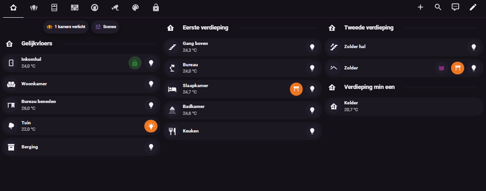

# Glowify Dashboard



_Het Glowify-dashboard: Thuis-view met verdiepingsblokken en interactieve kamerbalken._

Een custom **Home Assistant dashboard-strategie** van Glowify. Ze genereert
automatisch een merkgetrouw dashboard — Thuis-view met verdiepingsblokken,
interactieve kamerbalken, zelfvullende kamer-pop-ups, snelpanelen en de
Glowify-kleurtaal — rechtstreeks uit je **Areas, floors en entiteiten**.

Waar de vroegere aanpak een handgeschreven YAML-sjabloon per woning vroeg,
bouwt deze strategie alles dynamisch op. Elk nieuw toestel in de juiste Area
verschijnt vanzelf.

## Features

- **Thuis-view** met verdiepingsblokken (HA-floors, of een handmatige indeling)
  en per kamer een **Bubble Card kamerbalk** met temperatuur als status (terugval
  op luchtvochtigheid).
- **Dynamische kleurtaal** op de sub-knopjes: het lampje kleurt mee met de lamp,
  slot groen/rood, zonwering oranje, ventilator blauw, beweging enkel zichtbaar
  bij beweging.
- **Zelfvullende kamer-pop-ups** per domein (camera live, verlichting, zonwering,
  ventilatie, schakelaars, sloten, verwarming, media) — native, geen auto-entities.
- **Domein-tabbladen**: Lampen, Ventilatie, Zonwering, Schakelaars, Sloten.
- **Per-kamer pagina's** (subview) via lang indrukken op een kamerbalk.
- **Snelpanelen** (browser_mod): tik op het lampje bij licht uit → licht aan + een
  pop-up van 13 s met drie regelaars en vier scenechips (Gezellig/Relax/Normaal/Fel).
- **Bewerkmodus** met een subtiel potlood-chipje (standaard uit, onthouden per
  browser).
- **Plusknop-editor** met native HA-kiezers en een live voorbeeld.
- **Opruimmodus**: verberg overbodige toestellen via het label `verberg`.
- **Rommelfilter**: werkregelpatronen, camera-instelschakelaars, groepsentiteiten
  en `verberg`-toestellen blijven overal weg.

## Vereisten

Deze frontend-onderdelen worden verondersteld aanwezig te zijn (via HACS):

- [Mushroom](https://github.com/piitaya/lovelace-mushroom)
- [Bubble Card](https://github.com/Clooos/Bubble-Card)
- [card-mod](https://github.com/thomasloven/lovelace-card-mod)
- [browser_mod](https://github.com/thomasloven/hass-browser_mod) (ook als integratie)

Home Assistant **2026.5** of nieuwer (voor de custom dashboard strategy API en
de zichtbaarheid onder *Communitydashboards*).

## Volledige installatie

Voor een nieuwe woning: zie **[INSTALL.md](INSTALL.md)** — het volledige
draaiboek (thema, Areas/floors, backend-blokken, dashboard toevoegen, testen).
De meegeleverde bestanden:

- `themes/glowify.yaml` — het merkthema (lichte en donkere modus).
- `backend/glowify_scripts.yaml` — de vier scènescripts (werken via `doelgroep`).
- `backend/configuration.example.yaml` — frontend-blok, includes, lichtgroepen
  en de acht scene-schuifjes.

## Installatie via HACS

1. Open **HACS** → rechtsboven de drie puntjes → **Custom repositories**.
2. Repository: `https://github.com/ollie5-1/glowify-dashboard`, type **Dashboard**.
   Klik **Add**.
3. Zoek **Glowify Dashboard** in de HACS-lijst, open het en klik **Download**.
4. Ververs hard: F12 → Network → *Disable cache* aan → twee keer F5 → vinkje uit.
5. Voeg het dashboard toe: **Instellingen → Dashboards → Dashboard toevoegen →
   Communitydashboards → Glowify Dashboard**.

> HACS installeert het bestand `glowify-dashboard.js` uit de nieuwste **release**
> (gepubliceerd door de release-workflow) en registreert het als frontend-resource.

## Dashboard toevoegen

**Instellingen → Dashboards → Dashboard toevoegen → Communitydashboards →
Glowify Dashboard.**

Of handmatig via de Ruwe configuratie-editor:

```yaml
strategy:
  type: custom:glowify
  options:
    title: Glowify
```

De strategie leest je woning en bouwt de rest zelf op. Zie
[Opties](#opties) voor de fijnafstelling.

**Bediening:** tik op een kamerbalk voor de pop-up, **lang indrukken** voor de
volledige kamerpagina (subview). Bovenaan staan naast **Thuis** de domein-
tabbladen **Lampen, Ventilatie, Zonwering, Schakelaars, Sloten**, telkens per
kamer gegroepeerd.

## Opties

Alle opties zijn optioneel; standaard werkt de strategie zonder configuratie.

| Optie | Betekenis |
|---|---|
| `title` | Titel van het dashboard / de Thuis-view |
| `light_group_prefix` | Naamconventie voor lichtgroepen (default `verlichting_`) |
| `manual_floors` | Handmatige verdiepingsindeling voor installaties zonder HA-floors |
| `floors` | Per-verdieping: `hidden`, `order`, `name`, `icon`, `level` |
| `rooms` | Per-kamer: `hidden`, `order`, `icon`, `name`, `extra_sub_buttons`, … |
| `hidden_areas` | Lijst van area_id's om volledig te verbergen |
| `extra_chips` | Extra chips bovenaan de Thuis-view |
| `show_plus_chip` | Plus-chip in de chips-rij (plusknop-editor). Default `true` |
| `show_cleanup_chip` | Opruim-chip in de chips-rij (opruimmodus). Default `true` |
| `plus_on_bars` | Plusknopje op elke kamerbalk. Default `true` |

Voorbeeld met een handmatige verdiepingsindeling:

```yaml
strategy:
  type: custom:glowify
  options:
    manual_floors:
      - name: Gelijkvloers
        icon: mdi:home-floor-0
        level: 0
        areas: [inkomhal, woonkamer, keuken, tuin]
      - name: Eerste verdieping
        level: 1
        areas: [master_bedroom, badkamer, bureau_ruimte]
    rooms:
      berging:
        hidden: true
```

## Kernfeatures

- **Bewerkmodus** — standaard toont het dashboard enkel bediening. Een subtiel
  grijs potlood-chipje bovenaan zet de bewerkmodus aan (het kleurt paars): dan
  verschijnen de plusjes op de kamerbalken en de plus- en opruim-chip. De stand
  wordt per browser onthouden (localStorage).
- **Plusknop-editor** — een plusje in de chips-rij en op elke kamerbalk opent
  een dialoog met de native HA-componenten: een echte entiteitenkiezer (met
  zoek), een icoonkiezer, een Glowify-kleurkeuze en een actiekeuzelijst
  (kamer-pop-up, aan/uit, script, scene, more-info, zonwering, eigen pad), met
  een live voorbeeld van het knopje. De toevoeging wordt via de lovelace-API in
  de strategie-opties bewaard, waarna het dashboard zichzelf vernieuwt.
- **Opruimmodus** — het bezem-chip opent een beheerlijst waarin je elk toestel
  het label `verberg` geeft (of terugdraait) via de websocket-API. Verborgen
  toestellen verdwijnen overal uit het dashboard.
- **Kleurtaal** — iconen en kleuren wisselen dynamisch mee met de status.

## Ontwikkelen

```bash
npm install
npm run build      # productie-bundle → dist/glowify-dashboard.js
npm run watch      # herbouwt bij wijzigingen
npm run typecheck  # TypeScript-controle
```

De build produceert één bestand (`dist/glowify-dashboard.js`) dat HA als
frontend-resource laadt — dezelfde single-file aanpak als de mushroom-strategy.

## Kleurtaal

Eén vaste betekenis per kleur: groen = veilig, rood = aandacht,
oranje (`#EC7622`) = comfort actief, blauw (`#4C80C9`) = lucht/klimaat,
paars (`#8E2F89`) = speciale stand/scène, grijs = neutraal.

## Licentie

MIT © Glowify
